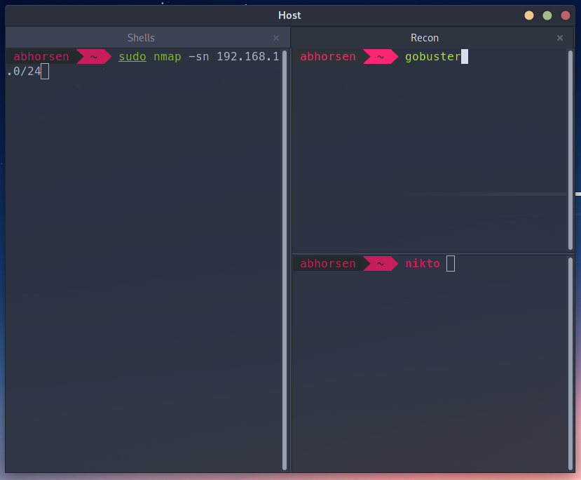

Many tips and tricks for efficient usage of terminals.

## Bash/Zsh Cursor Control

| Shortcut       | Description        |
| -------------- | ------------------ |
| ++ctrl+left++  | Previous word      |
| ++ctrl+right++ | Next word          |
| ++home++       | Start of line      |
| ++end++        | End of line        |
| ++ctrl+u++     | Clear current line |
| ++ctrl+l++     | Clear screen       |
| ++ctrl+r++     | Search history     |

## Terminator Shortcuts

???+ note
     This assumes you're using `terminator` as configured in ~~this repo's ansible role~~ an ansible role that I wrote and haven't published, so... your mileage may vary

| Shortcut                     | Description                                                            |
| ---------------------------- | ---------------------------------------------------------------------- |
| ++win+right++                | Split terminal right                                                   |
| ++win+down++                 | Split terminal down                                                    |
| ++alt+down++                 | Select down                                                            |
| ++alt+up++                   | Select up                                                              |
| ++alt+left++                 | Select left                                                            |
| ++alt+right++                | Select right                                                           |
| ++ctrl+shift+t++             | Create tab                                                             |
| ++ctrl+page-down++           | Next tab                                                               |
| ++ctrl+page-up++             | Previous tab                                                           |
| ++ctrl+alt+r++               | Rename tab                                                             |
| ++ctrl+alt+x++               | Rename window                                                          |
| ++ctrl+shift+x++             | Toggle terminal zoom (make single pane takeup full window temporarily) |
| ++ctrl+shift+open-bracket++  | Broadcast key presses to all shells in tab                             |
| ++ctrl+shift+close-bracket++ | Stop broadcasting keys to all shells                                   |

### Example Layout

1. Create second tab (++ctrl+shift+t++)
2. Name tab "Recon" (++ctrl+alt+r++)
3. Split in half to right (++win+right++)
4. Split right panel in half down (++win+down++)

If you need to ssh into a machine (like a kali VM) and cd to a directory on multiple windows in the frame, you can use
++ctrl+shift+open-bracket++ 

## Terminator Plugins

Terminator has multiple plugins that can be enabled with Right Click > Preferences > Plugins

Some useful plugins are listed below

### Activity Watch

**Right Click > Watch for Activity** and when the terminal has activity it will show a desktop notification

### Logger

**Right Click > Logger** will prompt for a location to save a log file, once you stop logging it will save
